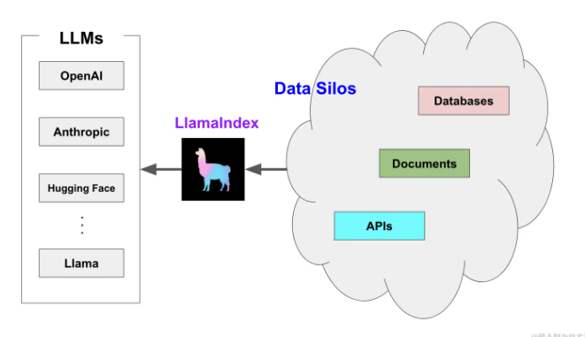
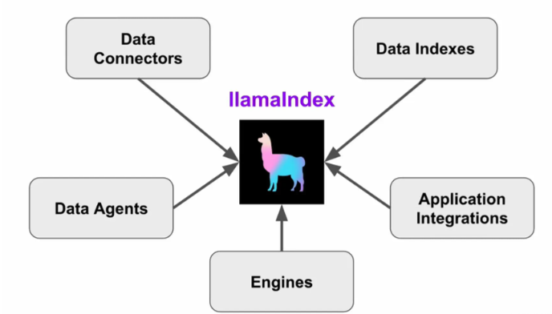
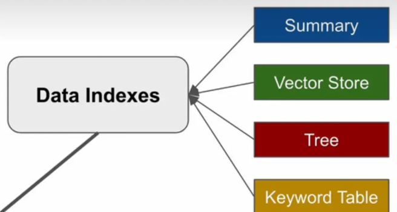
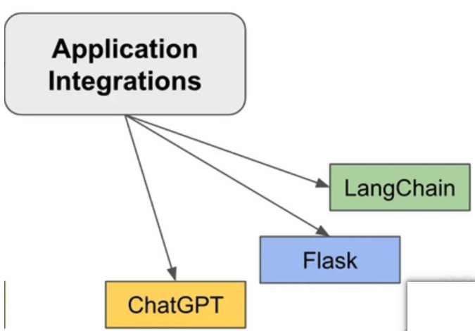

## 前言
LlamaIndex 是一个用于 LLM 应用程序的数据框架，用于注入，结构化，并访问私有或特定领域数据。LLM(各种大模型)基于全网公开数据，向我们提供了基于自然语言交互的接口能力。但是，当我们在开发一些AI应用时，需要基于私有或特定数据来增强LLM的能力。LlamaIndex擅长将散落于各种数据库、各种文档的知识，与LLM结合，为AI应用提供定制性的ARG能力。如下图：

左边是它支持的大模型，右边是数据的来源，可以是数据库、各类文档和原有各种APIS。当我们在帮助大型企业或机构开发其私有专家知识库时，LlamaIndex帮我们摆平这些纷繁复杂的数据。

## LlamaIndex的功能模块

>LlamaIndex为我们提供了如上图的五大功能模块，我们一一来解析。

- Data Connectors
    它帮助应用程序注入已有的数据，从字面意义也好理解，帮助程序连接各种数据，专治各种数据源、不同格式（数据库、API、....、SQL），Data Connectors都提供了相应的接口。
    
- Data Indexes
    该模块帮助我们将数据转换成大模型更好处理的数据格式。下图列出了四种，其中包括我们在使用OpenAI的Embedding接口时，经常使用的向量数据
    

- Engines
    引擎提供了我们自然语言访问数据的模块和接口。比如，查询引擎Query,具有强大的查询接口，能够帮助我们构建基于知识的输出。聊天引擎Chat,是一个对话的接口，能够具有沟通能力，具有记忆、聊天历史等功能

- Application Integrations
    此模块可以方便的将LlamaIndex与AI应用框架结合。目前，用的比较多的是LangChain。LangChain与LlamaIndex一起联手，打造私有专家知识库AI智能系统，很快很强大。
    
- Engines